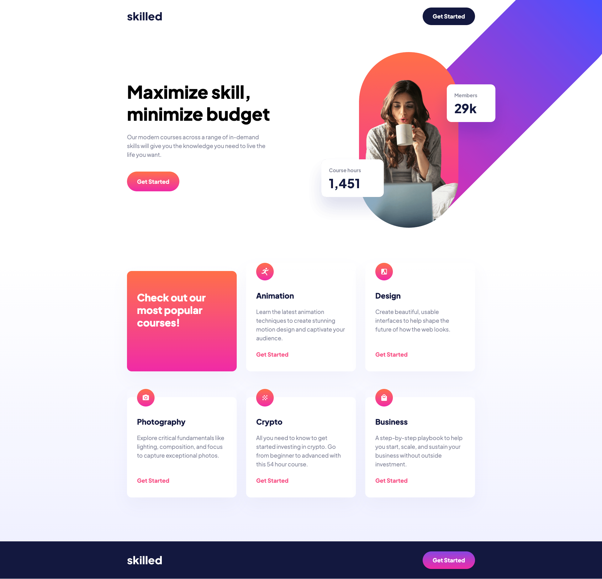

# Frontend Mentor - Skilled e-learning landing page solution

This is a solution to the [Skilled e-learning landing page challenge on Frontend Mentor](https://www.frontendmentor.io/challenges/skilled-elearning-landing-page-S1ObDrZ8q).

## Table of contents

- [Overview](#overview)
  - [The challenge](#the-challenge)
  - [Screenshot](#screenshot)
  - [Links](#links)
- [My process](#my-process)
  - [Built with](#built-with)
  - [Useful resources](#useful-resources)
- [Author](#author)

## Overview

### The challenge

To build out this landing page and get it looking as close to the design as possible.

Users should be able to:

- View the optimal layout depending on their device's screen size
- See hover states for interactive elements

### Screenshot

### Links

- Solution URL: [Add solution URL here](https://your-solution-url.com)
- Live Site URL: [Add live site URL here](https://your-live-site-url.com)

## My process

### Built with

- Semantic HTML5 markup
- CSS custom properties
- Flexbox
- Mobile-first workflow
- [Sass](https://sass-lang.com/) - For styles

### Deploying the project

Project hosted for free, thanks to:

- [Netlify](https://www.netlify.com/)

### Useful resources

- [https://www.welldonecode.com/perfectpixel/](https://www.welldonecode.com/perfectpixel/) - This chrome extension was very useful in order to place absolute hero image.

## Author

- Linkedin - [https://www.linkedin.com/in/antoru/](https://www.linkedin.com/in/antoru/)
- Frontend Mentor - [https://www.frontendmentor.io/profile/antoru](https://www.frontendmentor.io/profile/antoru)
